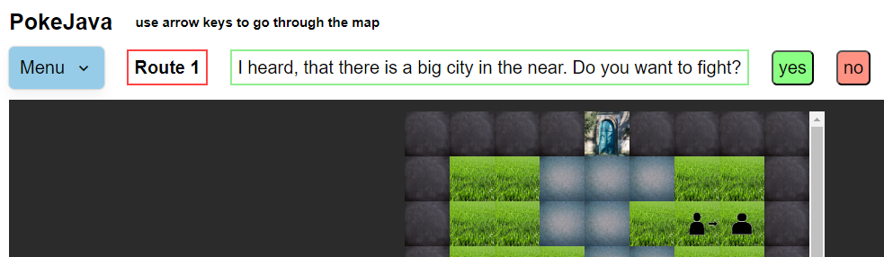

# PokeJava - a Full Stack Webapp by Waldemar Schröder
This is my first selfmade Full Stack Webapp: PokeJava  
Initially, I wanted to challenge my java skills by building something useful (and maybe gain a job as a java dev).  

First, I wanted to build something with JSP, but I didn't get very familiar with JSP.  
Then I found java spring boot, I found a good "hello world" base. From that I build the backend of PokeJava.  
I installed a java spring boot extension in VS Code, I click on the run button and then I can start the game in the browser on http://localhost:8080/.  
The java backend only was boring and then I build the frontend with JS.  
Later I found out, that building a frontend is not quite easy.  
Maybe I have invested more time in JS than in java...  

The game is not finished yet. There are 4 different PokeJavas. There is a big map with a gym and 5 smaller maps.  
But the game is playable, the main functions are working.  

Earlier, I asked StackOverFlow for solutions, now I am asking ChatGPT.  

